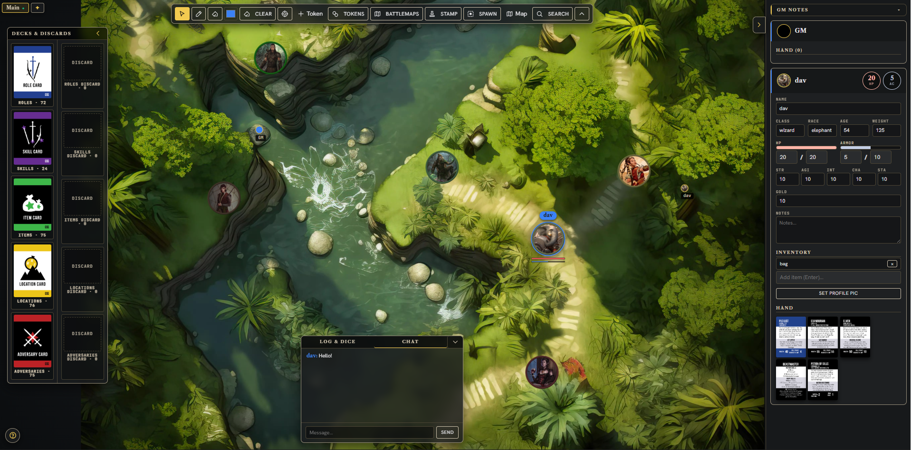

# Deck Quest VTT

A browser-based virtual tabletop for [Deck Quest](https://www.garagesofagames.com/games/deck-quest), an open-ended card-based tabletop RPG. Two self-contained HTML files — one for the GM, one for players — sync in real time over a WebSocket relay so your group can play together remotely with no installs, no accounts, and no setup beyond downloading a file.



*The GM view: multiple boards, a battlemap with character and NPC tokens, the deck & discard panel, dice/chat log, and the player roster.*

---

## Download & Play

Grab **`gm.html`** and **`player.html`** from the [latest Release](../../releases/latest).

> **v0.4.0 — File size:** ~650 KB each. Images are no longer embedded; the GM loads them from a local assets folder on first launch (see setup below).

### GM — first-time setup

1. **Download the Deck Quest Assets folder** from Google Drive:
   👉 [https://drive.google.com/drive/folders/1BWYKOh0a8kXQD-DMUdobWBtP-_GkkLVl?usp=sharing](https://drive.google.com/drive/folders/1BWYKOh0a8kXQD-DMUdobWBtP-_GkkLVl?usp=sharing)
   *(Request access if the link is restricted — the folder will be shared with you.)*
2. Extract / save the folder anywhere on your computer.
3. Open `gm.html` in **Google Chrome** (required for file system access).
4. A setup dialog will appear — click **Open Assets Folder** and select the downloaded `Deck Quest Assets` folder.
5. Chrome will ask for read permission — click **Allow**.
6. Enter the number of players (1–10) when prompted. Cards and tokens load automatically.

> **Every subsequent launch:** the setup dialog will appear again — just select the same folder. Chrome remembers the permission as long as the folder hasn't moved.

### GM — starting a session

1. Open `gm.html` in Chrome and complete the assets folder setup (above).
2. Enter the number of players (1–10) when prompted.
3. The room code appears in the top bar — share it with your players.
4. Once everyone has joined, start the adventure.

### Players — joining a session

1. Open `player.html` in any modern browser (Chrome, Firefox, Edge, etc.).
2. Enter the room code the GM shared with you.
3. Pick a slot, type your name, optionally upload a profile picture.
4. Click **Join**. Your character token appears on the table automatically.

---

## How to Play

### Overview

One player is the **Game Master (GM)**. The GM controls the story, manages NPCs and adversaries, draws from the shared decks, and has full visibility of everything. The remaining players each control one character.

Each player starts with a hand of cards dealt by the GM — typically one Role card and several Skill or Item cards. Cards define what your character can do.

### The Card Decks

| Deck | What's in it |
|---|---|
| **Roles** | Character classes (Paladin, Wizard, Rogue, …). Defines your base stats and playstyle. |
| **Skills** | Abilities and talents your character can use. |
| **Items** | Weapons, armor, and equipment that provide stat bonuses. |
| **Locations** | Scene cards the GM plays to describe where the party is. |
| **Adversaries** | Enemies the GM places on the table for encounters. |

### Drawing Cards

The GM clicks a deck stack on the left panel to draw the top card. A menu appears offering to send it to:
- **GM hand** — private, only the GM sees it
- **Table** — placed face-down or face-up for everyone to see
- **Any player's hand** — dealt privately to that player

### Your Hand

Cards in your hand appear in your player panel on the right side. Right-click a card in your hand to flip it face-up (reveal to others), move it to the table, discard it, or return it to the deck.

### The Table

The center area is the shared table. Cards and tokens can be freely moved around.

- **Drag** any card or token to move it.
- **Right-click** to open a context menu with actions (flip, lock, rotate, delete, etc.).
- **Alt + hover** a card to see a full-size preview.
- **Scroll wheel** to zoom. **Space + drag** to pan.
- **Ctrl + click** multiple items to multi-select. Drag-lasso on empty space also selects.
- Right-click a multi-selection for group actions (delete, lock/unlock, **Make Group**).
- **Grouped tokens** move together as one unit. Right-click a group to Ungroup.

### Tokens & Figurines

The GM (and players) can place tokens on the table:

- **Character tokens** are created automatically from each player's profile pic. They show the player's name and HP/armor bars.
- **D&D Token Library** — click the Tokens button in the toolbar to browse 1 924 pre-built tokens (monsters, NPCs, objects). Click any token to drop it on the table.
- **Custom uploads** — use the **+ Map** and **+ Token** buttons in the toolbar to upload any image as a map background or figurine.
- **Resize** a token by hovering it and dragging the gold handle at the bottom-right corner.
- **Right-click** any token for a full menu: rename/label, edit HP & Armor, lock, rotate, flip, change opacity, z-order, status effects, duplicate, delete.

### HP & Armor Bars

Every token with HP assigned shows a **red health bar** above it (below for character tokens). An **armor bar** (blue) appears beside it when armor points are above zero.

- When HP reaches **0**, the token displays a skull overlay.
- **Edit HP / Armor** — right-click any token → "❤ Edit HP / Armor…" to update current and max values in a popup.
- Character tokens automatically reflect the stats from the player's sheet.

### Player Stats Sheet

Each player has a collapsible panel in the right rail showing:
- Name, Class, Race, Age, Weight
- HP and Armor (bars + editable numbers)
- STR / AGI / INT / CHA / STA
- Gold and Inventory
- Notes

The GM can edit any player's stats directly.

### Status Effects

Right-click a token → Status Effects to toggle visual badges:
⚔️ Attacking · 🛡️ Defending · 🩸 Bleeding · ☠️ Poisoned · 💫 Stunned · 👻 Invisible · 🌫️ Sneaking · 💀 Down

### Drawing Tools

The toolbar at the top-center has three drawing tools:
- **Pointer** — move and interact with tokens and cards
- **Pen** — draw freehand lines visible to everyone; pick a color with the swatch
- **Eraser** — click a stroke to remove it

GM can clear all drawings. Players can undo their own last stroke.

### Dice

The **Log & Dice** panel (bottom-left) has buttons for d4, d6, d8, d10, d12, d20, d100, and a custom `NdM+K` field. Every roll is broadcast to all players in the shared log.

### Chat

The **Chat** panel (bottom, beside Log & Dice) is a live text chat visible to all players. Press Enter or click Send to post.

### GM Notes

A private **GM Notes** section at the top of the right rail is only visible to the GM. Use it for encounter planning, secret NPC details, or anything you don't want players to see.

### Saving & Loading

- **Autosave** — the GM's session is automatically saved to browser localStorage on every state change.
- **Save** (top bar) — downloads the full session as a JSON file, including all uploaded assets (maps, custom tokens, profile pics).
- **Load** (top bar) — restores a saved session from a JSON file.
- **New Session** — starts fresh with a new room code and shuffled decks.

---

## Features

### Table & Cards
- 337 embedded cards across 6 decks (Roles, Skills, Items, Locations, Adversaries, Info)
- Draw to GM hand / table / any player's hand
- Cards on table: drag, rotate, flip face-up/down, lock, discard, return to deck
- Discard pile viewer — click a discard to see it; return cards to deck, table, or hand
- Alt+hover any card for a full-size preview
- Card search overlay (GM) — search by name and spawn to table or any hand

### Tokens & Figurines
- 1 924 D&D tokens embedded across 90+ categories, with search
- Character tokens auto-spawned per player with their profile pic
- Custom image uploads (maps and tokens) from local files
- HP/armor bars above every token; skull at HP 0
- Status effect badges (8 types)
- Named cursors showing each player's position in real time

### Interaction
- Multi-select: Ctrl+click or drag-lasso; group drag; group actions
- Grouping: "Make Group" binds tokens so they move together
- Pan (Space+drag) and Zoom (scroll wheel + reset button)
- Shared freehand drawing layer: pen, eraser, color picker

### UI Panels (all collapsible)
- **Decks** panel (GM) — slides left to hide
- **Discards** panel (GM) — slides right to hide
- **Toolbar** — slides up to hide
- **Right rail** (player stats) — slides right to hide
- **Log & Dice** — collapsible header
- **Chat** — collapsible

### GM Tools
- Edit all player stats live
- Private GM notes (not synced to players)
- Clear all drawings
- Token HP/Armor edit popup (right-click any token)
- Save / Load / Autosave session (includes all uploaded assets)

---

## Development

### Requirements

- **Node.js** (any recent LTS)
- `npm install` — installs `sharp` (image processing for token thumbnails)

### Build

```bash
node build.js
```

Reads all card PNGs from `Deck Quest Open Source PNGs/`, compresses the 1 924 token images to 128×128 via sharp, base64-encodes the embedded fonts from `fonts/`, and outputs `dist/gm.html` and `dist/player.html` (~145 MB each).

**First build takes 2–3 minutes** (sharp compressing all tokens). Subsequent builds of only template changes are just as slow — sharp runs every time. If you're only editing templates, you can comment out the token scan temporarily.

### Quick syntax check

```bash
node -e "const fs=require('fs'); try{new Function(fs.readFileSync('templates/shared.js','utf8')); console.log('OK')}catch(e){console.error(e.message)}"
```

### File layout

```
build.js                          # build script — embeds cards, tokens, fonts → dist/
package.json                      # { "dependencies": { "sharp": "^0.33.0" } }
fonts/                            # woff2 fonts (base64-embedded at build time)
templates/
  shared.js                       # entire game engine (~2 500 lines)
  gm.template.html                # GM client markup + CSS
  player.template.html            # Player client markup + CSS
relay/
  server.js                       # WebSocket relay (hosted on Render.com)
  package.json
Deck Quest Open Source PNGs/      # card art + D&D token library
dist/                             # built output (gitignored)
  gm.html
  player.html
```

### Releasing

```bash
node build.js
git add templates/ build.js fonts/  # (or whatever changed)
git commit -m "vX.Y.Z: description"
git push
gh release create vX.Y.Z dist/gm.html dist/player.html --title "vX.Y.Z: …" --notes "…" --latest
```

---

## Tech Stack

| Layer | What |
|---|---|
| **Networking** | WebSocket relay server (`relay/server.js`) hosted on [Render.com](https://render.com) — pure message router, no game logic |
| **State model** | GM is the authoritative host. All mutations are ops sent to the GM, applied, then broadcast as a filtered state snapshot to players. |
| **Asset transfer** | Uploaded maps/tokens/profile pics are chunked as base64 over WebSocket and cached in **IndexedDB** |
| **Persistence** | **localStorage** autosaves the GM session on every state change. Manual save exports JSON. |
| **Card/token data** | Embedded as `<script type="application/json">` tags in the HTML, parsed with `JSON.parse()` at boot for fast startup (~15–30 s vs 5–10 min for inline JS literals) |
| **Rendering** | Vanilla JS DOM — no framework. `el()` builder, `renderAll*()` re-renders on every state change. |
| **Fonts** | Libre Caslon Text, Hanken Grotesk, JetBrains Mono — base64-embedded at build time (no CDN required) |
| **Build tool** | `build.js` — Node.js script using `sharp` for token image compression |

---

## License

Card art and game content © [Garages of a Games](https://www.garagesofagames.com/games/deck-quest). VTT source code is MIT licensed.
